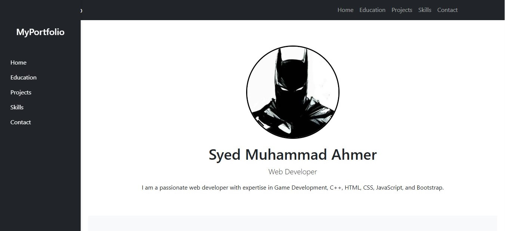
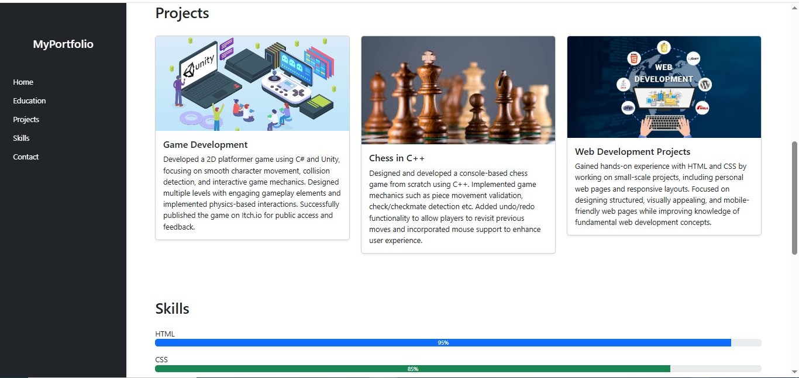
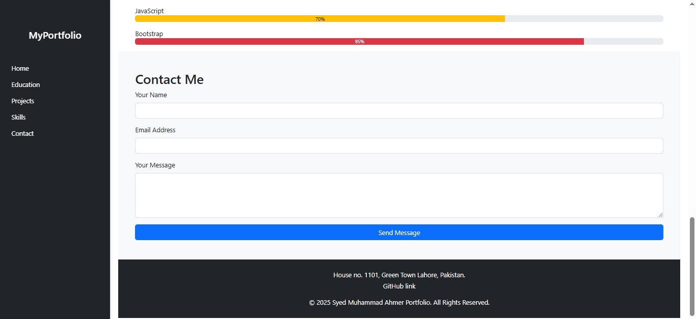

# Web-Dev-Portfolio-Project
personal porfolio project:
Description:
My portfolio website project is a responsive and interactive platform showcasing my education, projects, skills, and contact details. Built with Html,CSS and Bootstrap, it features a navigation bar, a sidebar for profile details, and a mobile-friendly layout with a toggling sidebar. The project includes a contact form with validation, a project showcase using cards, and a modern UI with smooth animations. It highlights my work in a professional, visually appealing manner while ensuring easy navigation across different sections.
Screenshots:

